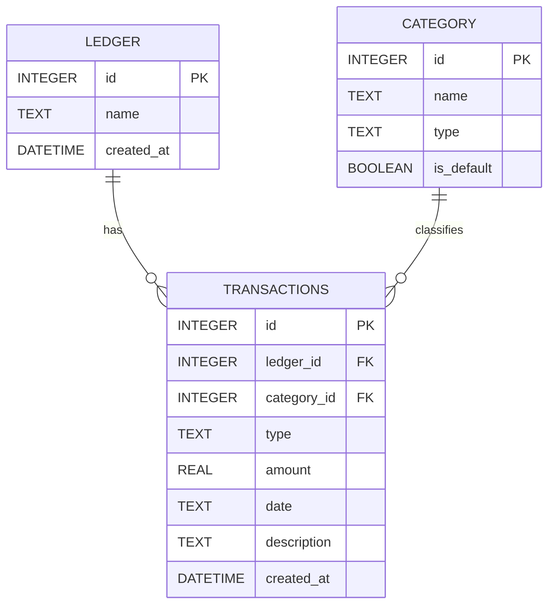

# DB Design Document - 個人記帳簿系統

本文件根據 PRD 與流程圖設計 SQLite 的資料表、型別與關聯。

## 1. ER 圖（實體關係圖）

## 2. 資料表詳細說明

### `ledgers` (記帳本)
| 欄位名稱 | 型別 | 必填 | 說明 |
| --- | --- | --- | --- |
| `id` | INTEGER PRIMARY KEY AUTOINCREMENT | 是 | 系統流水號 |
| `name` | TEXT | 是 | 記帳本名稱 |
| `created_at` | DATETIME | 是 | 建立時間 |

### `categories` (收支分類)
| 欄位名稱 | 型別 | 必填 | 說明 |
| --- | --- | --- | --- |
| `id` | INTEGER PRIMARY KEY AUTOINCREMENT | 是 | 系統流水號 |
| `name` | TEXT | 是 | 分類名稱 |
| `type` | TEXT | 是 | `income` (收入) 或 `expense` (支出) |
| `is_default` | BOOLEAN | 是 | 是否為系統預設分類 |

### `transactions` (收支紀錄)
| 欄位名稱 | 型別 | 必填 | 說明 |
| --- | --- | --- | --- |
| `id` | INTEGER PRIMARY KEY AUTOINCREMENT | 是 | 系統流水號 |
| `ledger_id` | INTEGER | 是 | 對應 `ledgers.id` |
| `category_id` | INTEGER | 是 | 對應 `categories.id` |
| `type` | TEXT | 是 | `income` (收入) 或 `expense` (支出) |
| `amount` | REAL | 是 | 金額 |
| `date` | TEXT | 是 | 發生日期 (`YYYY-MM-DD`) |
| `description` | TEXT | 否 | 備註 |
| `created_at` | DATETIME | 是 | 建立時間 |

## 3. SQL 建表語法
請參考 `database/schema.sql` 檔案。
