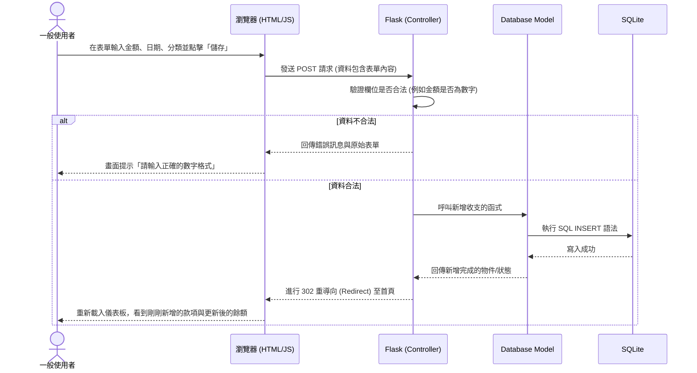

# 流程圖設計 (Flowchart) - 個人記帳簿系統

本文件根據 PRD 需求與系統架構設計，將使用者的操作路徑與後端的資料流進行視覺化，幫助開發團隊在實作前釐清動線與邏輯。

## 1. 使用者流程圖 (User Flow)

這張圖展示使用者進入「個人記帳簿系統」後，各項核心功能的操作路徑。系統將以 Dashboard 作為中心樞紐，發散至其他功能。

```mermaid
flowchart LR
    A([使用者開啟系統]) --> B[首頁 / 儀表板 Dashboard]
    
    B --> C{選擇要執行的操作}
    
    C -->|1. 查看收支| D[瀏覽當月餘額與統計圖表]
    D --> B
    
    C -->|2. 新增收支明細| E[進入新增收支表單]
    E --> F[選擇分類、輸入金額與日期]
    F --> G[儲存紀錄]
    G --> B
    
    C -->|3. 管理記帳本| H{記帳本操作}
    H -->|新增本子| I[建立新記帳本 (上限 3~5 本)]
    I --> B
    H -->|切換本子| J[選擇其他記帳本]
    J --> B
    
    C -->|4. 導出紀錄| K[選擇日期區間與格式]
    K --> L[下載 CSV/Excel 檔案]
    L --> B
```

---

## 2. 系統序列圖 (Sequence Diagram)

以下以「新增收支明細」為代表情境，描繪完整的前後端資料流與元件互動過程：



---

## 3. 功能清單對照表 (URL 與 HTTP 方法設計)

整合以上流程，以下是未來即將開發的各主要功能、初步對應的 URL 路徑與 HTTP 方法清單：

| 功能名稱 | 說明 | URL 路徑 | HTTP 方法 |
| :--- | :--- | :--- | :--- |
| **首頁 / 儀表板** | 顯示當下選定記帳本的餘額、收支統計 | `/` 或 `/dashboard` | `GET` |
| **新增收支表單** | 獲取填寫收支紀錄的 HTML 頁面表單 | `/transactions/new` | `GET` |
| **儲存收支紀錄** | 將表單內容送至伺服器儲存 | `/transactions` | `POST` |
| **新增記帳本表單** | 獲取填寫新記帳本名稱的介面 | `/ledgers/new` | `GET` |
| **建立新記帳本** | 儲存新的記帳本 (將檢查數量上限) | `/ledgers` | `POST` |
| **切換記帳本** | 將目前工作環境切換至另一個記帳本 ID | `/ledgers/<id>/switch` | `POST` |
| **導出紀錄** | 匯出目前記帳本的資料為 CSV 格式 | `/transactions/export` | `GET` (或 `POST` 如果帶參數) |

> 備註：這個路由對照表為初步草案，在後續具體實作 API 或路由表定義時，可能會依據實際架構需要微微調整。
